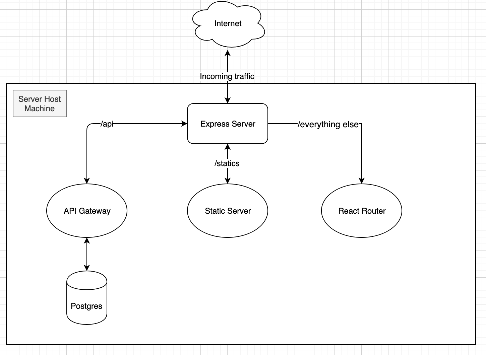

# List-it!

One stop shop to create and share lists of anything! World is your oyster.

---

## Application Use

The application flow is as follows:

1. Navigate to http://localhost:3000/list/<LIST_ID>

   LIST_ID can be any alphanumeric ID that is easy for you to remember.
   For e.g. if your LIST_ID is best-id-123 the URL would be http://localhost:3000/list/best-id-123

2. If a list exists, you'll be presented with the items in the list. If however, a list doesn't exist with that ID, a new one will be created for you.

3. Enjoy! Add, Remove, Drag items in your list as your feel and when you come back later, it'll be there just as you left it.

---

## Development

You'll need [Docker](https://www.docker.com/products/developer-tools) for development.
The Project uses [Makefile](https://opensource.com/article/18/8/what-how-makefile) syntax to simplify series of commands.

All \*nix based systmes (Linux, OSX) should come installed with `make`. There's also a Windows option called `Nmake` but now that
[WSL](https://docs.microsoft.com/en-us/windows/wsl/install-win10) is out, I'd recommend using that.

You can also just choose to use manual postgres installation and manual node setup but I prefer keeping things containerized.

Just clone this repository into your own project folder. and start working

```bash
git clone https://github.com/gyanesh-mishra/list-it
cd list-it
make build
make app
```

Here are some other Makefile commands to help with development.

`make run` : Launches the application using docker (Builds the images if they haven't been built before)

`make stop` : Stops any running containers

`make build` : (Re-)Builds container images listed in the docker-compose.

`make clean` : Purges containers, images and volumes.

NOTE: Port 5432 and 3000 must be free on your host machine for the containers to attach to them.

### Environment file

There is an .env.example file present in the root to help create a .env file. Currently, the application has fallbacks for any missing environment variables and can work without it.
However, for if you want, you can define your own set of configurations in the .env file and it'll be picked up the application and the docker-compose file.

---

## Architecture



---

## Directory Layout

```bash
.
├── /node_modules/          # 3rd-party libraries and utilities
├── /dist/                  # All the generated files will go here, and will run from this folder
├── /src/                   # The source code of the application
│   ├── /client/            # React app
│   ├── /server/            # Express server app
│   ├── /shared/            # The shared code between the client and the server
├── /assets/                # images, css, jsons etc.
├── .babelrc                # babel configuration
├── .eslintrc               # es-lint configuration
├── .prettierec             # prettier configuration
├── .gitignore              # ignored git files and folders
├── .nvmrc                  # Force nodejs version
├── .env                    # (ignored) Can be used to override environment variables
├── package.json            # The list of 3rd party libraries and utilities
├── Dockerfile              # Dockerfile to build container image
├── docker-compose.yml      # docker-compose configuration to orchestrate containers for local development
├── docker-compose-prod.yml # docker-compose configuration to orchestrate containers for production environment
└── tslint.json             # TypeScript linting configuration file
├── README.md               # This file
```

---

#### Licence

This code is released as is, under MIT licence. Feel free to use it for free for both commercial and private projects. No warranty provided.
